## Hi there 👋
🎓 I'm Porggg, a french Computer Science student at Ensimag - Grenoble INP.  
🌱 Currently looking for an internship in Computer Vision, a field I love to explore.

## What I'm studying 💻  

Under my exchange semester at POSTECH - Pohang University of Science and Technology, in South Korea.  
I have the opportunity to learn more about : 

<b>👁️ Computer Vision</b>

  
- Corner detection, SIFT, detection, segmentation, classification, tracking, neural networks  
- Implementation in python : https://github.com/Porggg/computer-vision

<b>🧠 Machine Learning</b>

- Supervised (Regression, classification with SVM & Neural Network)  
- Unsupervised (Clustering, PCA, density estimation)  
- Reinforcement (Markov, PI/VI, Monte-Carlo)  

<b>📸 Computational Imaging</b>

  
- Image formation, forward & inverse problems, rendering & multi-view)  

<b>⚙️ Differential Geometry</b>

  
- Curves in space, calculus & geometry on a Surface, Gauss-Bonnet theorem, Riemannian Geometry)  

  
<!--
**Porggg/Porggg** is a ✨ _special_ ✨ repository because its `README.md` (this file) appears on your GitHub profile.

Here are some ideas to get you started:

- 🔭 I’m currently working on ...
- 🌱 I’m currently learning ...
- 👯 I’m looking to collaborate on ...
- 🤔 I’m looking for help with ...
- 💬 Ask me about ...
- 📫 How to reach me: ...
- 😄 Pronouns: ...
- ⚡ Fun fact: ...
-->

<!-- ## 💻 Tech I've already used:
       
-->
<!--
## 🚧 My projects
I have two types of projects : 
- The one i made myself, in python during high school principally, and during my free time. (see repos)
- The one i did in college in C, Java, Python, and more. You can't find them here because they belong to Ensimag, But i give a short description of it on my website. (https://porggg.github.io/me/)
-->
